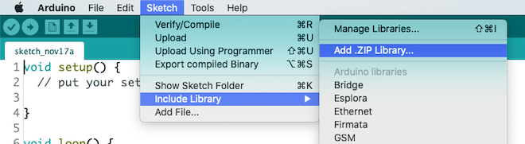
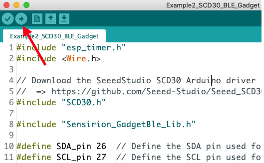

# Tutorial: SVM40 Homekit Integration

## Summary

This tutorial enables you to setup a VOC-Monitor sending Temperature, Humidity and Volatile Organic Compound (VOC) measurements via WiFi to Apple Homekit. This allows you to ask Siri about your air quality and, for example, switch on a smart light bulb if the air quality is poor.  All steps necessary and links are provided here.

The tutorial is structured in 3 parts

* **Hardware Setup**: Learn how to wire the sensor to the development board
* **Software Setup**: Learn how to setup your computer to program the development board
* **Homekit Setup**: Add the new gadget to homekit

## Hardware Setup

To complete this tutorial, you'll need
* ESP8266 DevKit (ESP32 is possible to, but not shown here)
* [Sensirions SEK-SVM40](https://www.sensirion.com/en/environmental-sensors/evaluation-kit-sek-svm40/) (available [here](https://www.digikey.com/en/products/detail/sensirion-ag/SEK-SVM40/12820417?s=N4IgTCBcDaIMoDUCyAWADCAugXyA)
* USB cable to connect the ESP8266 module to your computer

Connect the SEK-SVM40 module to the ESP8266 as depicted below:

* **VDD** (red) of the SEK-SVM40 to the **3.3V** of the ESP8266
* **GND** (black) of the SEK-SVM40 to the **GND** of the ESP8266
* **SCL** (yellow) of the SEK-SVM40 to the **GPIO 5 (D1)** of the ESP8266
* **SDA** (green) of the SEK-SVM40 to the **GPIO 4 (D2)** of the ESP8266
* **SEL** (blue) of the SEK-SVM40 to the **GND** of the ESP8266  (choosing the I2C interface)

## Software Setup

### Setup the Arduino IDE for the ESP8266 platform

The following instructions originate from [here](https://github.com/esp8266/Arduino)

1. Install the current version of the [Arduino IDE](http://www.arduino.cc/en/main/software).
2. Start the Arduino IDE and open the Preferences window.
3. Enter the following link into the *Additional Board Manager URLs* field. You can add multiple URLs, separating them with commas.
	* `https://arduino.esp8266.com/stable/package_esp8266com_index.json`
4. Open the Boards Manager from `Tools > Board -> Board Manager` and install the *esp8266* platform
5. Select your ESP8266 board from the `Tools > Board` menu after the successfull installation.
	* E.g. `Generic ESP8266`
(6. You can optimize your settings using [this description](https://github.com/Mixiaoxiao/Arduino-HomeKit-ESP8266#recommended-settings-in-ide))

### Setup the requried libraries

We'll be installing one library. Click the link below and download the newest .zip release packages

* The [Arduino Homekit ESP8266 Library](https://github.com/Mixiaoxiao/Arduino-HomeKit-ESP8266/releases)

For the downloaded .zip file: In the Arduino IDE, select `Sketch -> include Library -> Add .zip Library` and select the downloaded .zip file.

Restart the Arduino IDE.

### Download the code and launch the Gadget Firmware
1. Click on "Clone or Download" button (of this repository), then click "Download ZIP" on the page.
2. Extract the contents of the downloaded zip file.
3. Open the `wifi_info.h.example` with a text-editor, enter your WiFi credentials and save it in the same folder as `wifi_info.h`
4. Open the Arduino IDE.
5. Go to `File -> Open...` and open `homekitSVM40.ino`
6. Make sure the ESP8266 is connected to your computer.
7. Press the Upload button on the top left corner of the Arduino IDE.

## Homekit Integration

1. Open the Home App on your iPhone or iPad.
2. Use the "+"-sign to add a new device.
3. Chose "I do not have a code"
4. Select the SVM40-module
5. Insert 111-11-111 as the device code
6. Follow the final steps.

